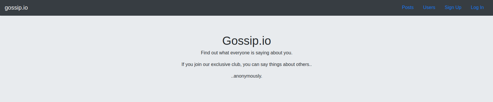

# Members-Only Project

The goal of this project is to implement a members only 'clubhouse' using Rails.

Normal users can view anonymously authored posts.

Users who are members can write posts and see the authors of posts.

This is a project from [The Odin Project](https://www.theodinproject.com/courses/ruby-on-rails/lessons/authentication).

## Pre-Project Thoughts

For Odin's Rail Curriculum so far, there hasn't been a huge amount of independent work.

A lot of the Rails section was following Michael Hartl's [Rails Tutorial](https://www.railstutorial.org).

I am hoping I absorbed enough knowledge to put it into practice and develop my skills accordingly.

### Structure

There will be a Users resource, with all seven of the RESTful routes.
	The attributes will be email, username, and password_digest.

There will be a Sessions resource, without a Active Record model, with the :new, :create, and :destroy routes.

There will be a Posts resource, with all seven of the RESTful routes.

Posts will belong to Users. Users will have many Posts.
	The attributes will be content and user_id.

## Post-Project Thoughts

This was a really fun project. 

I can feel a lot of the concepts I have learned coming together in a way where I can build things.

I learned a little bootstrap for this, considering I don't yet have strong design skills. 

I believe bootstrap is a good crutch until I learn those skills, so my creations don't look completely horrible.

There was a lot of experimenting, tinkering around, googling, and checking my notes to put this together.

I definitely feel my Rails code could be more structured and organized, but hey, I made something that works.